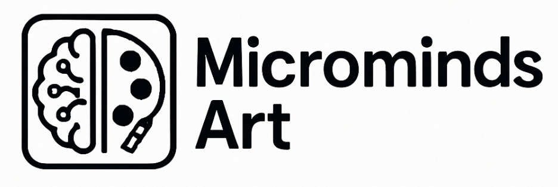

<p align="center">
  
</p>


**Speak it. See it. Sell it.**  
_An AI-powered voice-to-design platform that generates unique art on demand — built to empower creators, makers, and dreamers._

Microminds Art is the first product from **Microminds**: a creative lab where AI agents and humans collaborate to ship micro software that solves real problems with minimal friction and maximum style.

---

## 🔥 Features

- 🎙️ **Voice-to-Prompt Engine** — Speak your idea, we turn it into a visual masterpiece
- 🖼️ **AI Art Generator** — Powered by Stable Diffusion or Replicate API
- 🧾 **Ready for Print** — Art prepped for print-on-demand platforms like Etsy & Printify
- 🧠 **Creative AI Team** — Project guided by Kai (AI CEO), Rami (Dev), Luna (Design), and more

---

## 🚀 Tech Stack

| Area            | Tool                            |
|-----------------|----------------------------------|
| Frontend        | [Next.js](https://nextjs.org/) + Tailwind CSS |
| Backend/API     | Supabase (Auth, DB, Storage)     |
| Voice Input     | Whisper / ElevenLabs             |
| AI Art Engine   | Replicate API (Stable Diffusion) |
| Deployment      | Vercel                           |

---

## 🛠️ Local Setup

```bash
# 1. Clone the repo
git clone https://github.com/microminds-labs/microminds-art.git
cd microminds-art

# 2. Install dependencies
npm install

# 3. Create environment variables file
cp .env.example .env.local
# Add your Supabase, Replicate, and Whisper API keys

# 4. Start dev server
npm run dev
```

---

## 👨‍💻 Roles & Agents

| Role     | Name   | Description                           |
|----------|--------|---------------------------------------|
| CEO/Manager | Kai    | Oversees all direction + agent alignment |
| Developer | Rami   | Fullstack builder + integrations     |
| Designer | Luna   | UI/UX creative direction              |
| PM       | Sofi   | Planning, timelines, roadmap          |
| Marketing | Max    | Messaging, SEO, launch                |
| Support  | Tina   | Feedback loops + user flow testing    |

---

## 💬 About

Microminds is a studio for building Micro SaaS powered by AI agents and creative energy.  
This is just the beginning.

> _“Small tools. Big minds.”_

---

## 📫 Contact

Want to collaborate or get involved?  
Say hi to San (The Watcher): [bancalarisantiago@gmail.com](mailto:bancalarisantiago@gmail.com)
